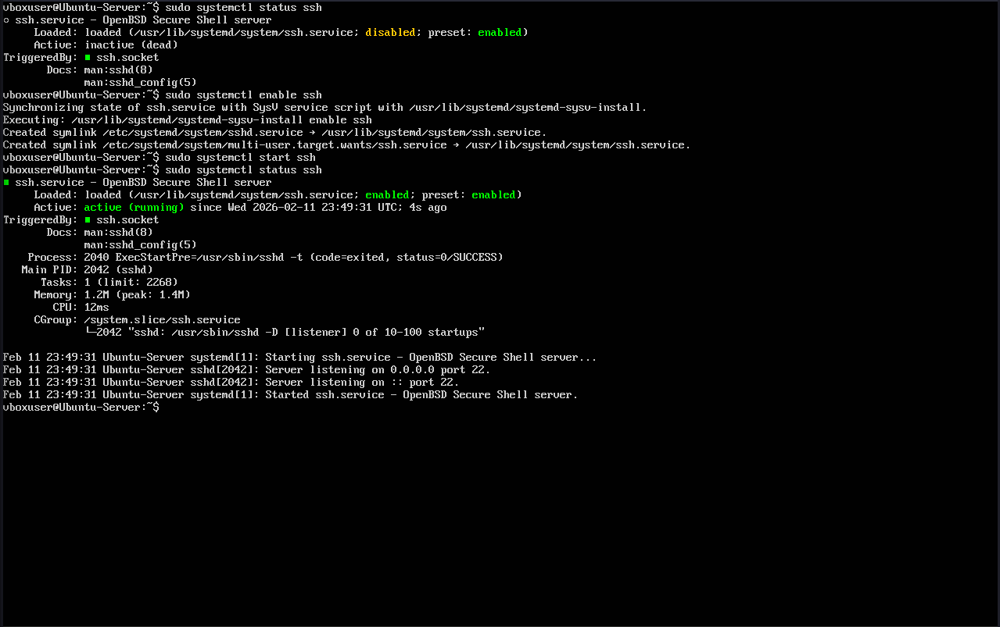
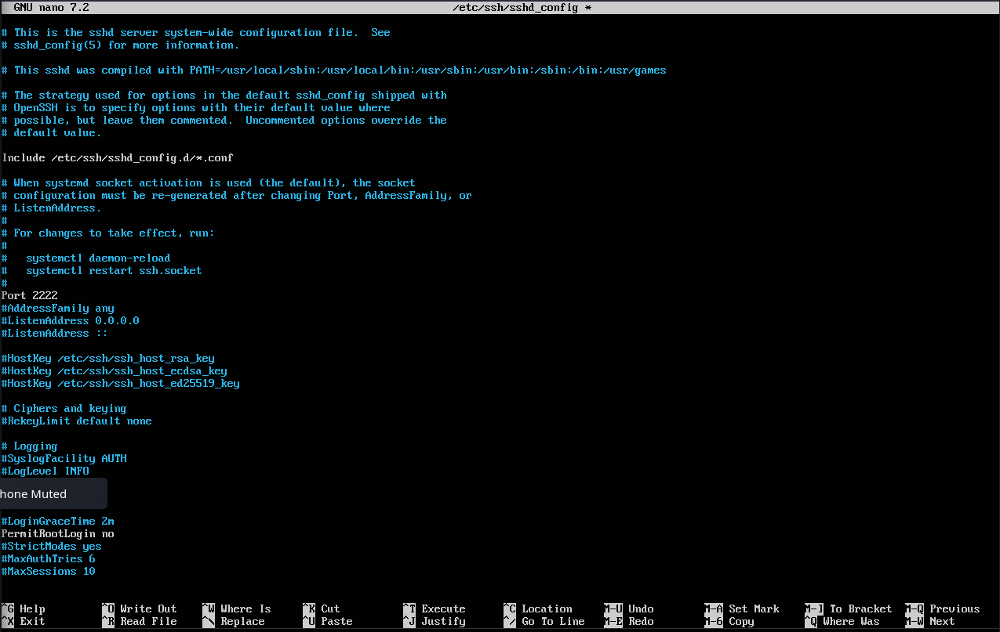
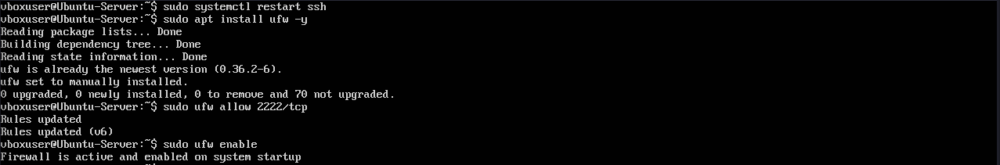
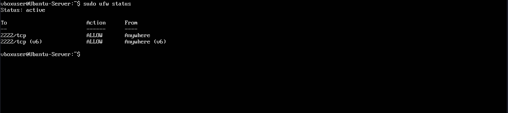
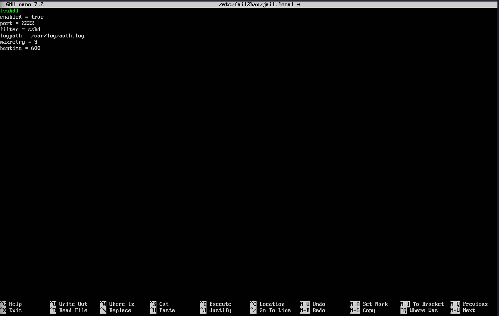
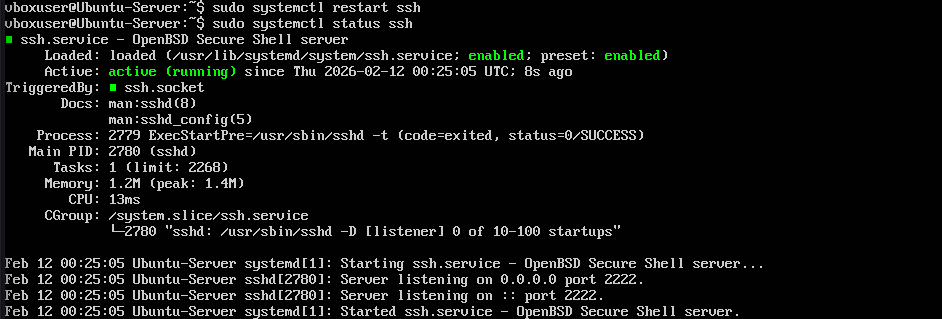

# Linux Server Hardening Lab (SSH & Fail2Ban)
## Objective
Simulate a real-world ssh brute-force threat scenario and implement defensive controls to reduce attack surface and automatically block malicious login attempts.

## Environment
- Ubuntu Server (VirtualBox VM)
- OpenSSH
- UFW (Uncomplicated Firewall)
- Fail2Ban
- Secondary machine used to simulate attack traffic

## Threat Scenario
Public-facing ssh services are frequently targeted by automated brute-force attacks attempting credential compromise.
This lab simulates that scenario and implements defensive controls including:
- ssh hardening
- Firwall configuration
- Log-based intrusion detection and automated IP banning

# The Lab:
## Installated ssh
- Installed Ubuntu Server on a VM for server hardening simulation
- Found ssh not preintsalled on the OS, so I updated the mirrors, installed ssh, started ssh, and confirmed that it was running.

Commands used:
```bash
sudo systemctl status ssh
sudo apt update && sudo apt install openssh-server -y
sudo systemctl enable ssh
sudo systemctl start ssh
sudo systemctl status ssh
```


## Hardened ssh
- Disabled root login by uncommenting the line and changing 'PermitRootLogin' to no
- Changed default port to 2222 instead of 22

Commands used:
```bash
sudo nano /etc/ssh/sshd_config
```


## Restarted ssh

Commands used:
```bash
sudo systemctl restart ssh
```

## Installed ufw
- Confirmed that ufw is installed on the machine
- Opened port 2222 to TCP connections

Commands used:
```bash
sudo apt install ufw -y
sudo ufw allow 2222/tcp
sudo ufw enable
sudo ufw status
```



## Installed Fail2Ban
- Configured fail2ban for ssh

Commands used:
```bash
sudo apt install fail2ban -y
sudo systemctl status fail2ban
sudo nano /etc/fail2ban/jail.local
sudo systemctl restart fail2ban
```


## Simulating brute-force attack
- Terminal was hanging at login, so I went back to the server VM to ensure that ufw has port 2222 open and that ssh is listening on the correct port (2222)
- Found that ssh was not listening on port 2222 as intended
- Used nano to confirm that the ssh config changes had been commited
- Restarted ssh to apply config changes
- Confirmed ssh is now listening on port 2222

Commands used:
```bash
sudo ufw status
sudo ss -tulpn | grep ssh
sudo nano /etc/ssh/sshd_config
sudo systemctl restart ssh
sudo systemctl status ssh
```



### Brute-force attack 2
